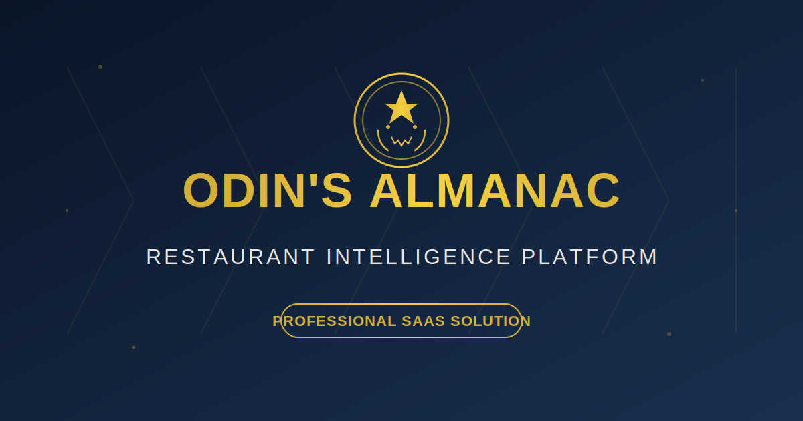

# 🍽️ Odin's Almanac

**Restaurant Intelligence Platform** - A comprehensive SaaS solution for modern restaurant management with AI-powered food safety, expiration tracking, P&L management, and automated line checks.



---

## 🌟 Features

### 🤖 **AllWise Navigator**
AI-powered chatbot specializing in food safety compliance:
- HACCP guidelines and best practices
- FDA Food Code regulations
- USDA compliance standards
- Foodborne illness prevention
- Real-time answers to food safety questions

### 📊 **P&L Spreadsheet Creator**
Professional financial management for restaurants:
- Set monthly revenue and expense targets
- Track actual performance vs. targets
- Automatic variance calculations
- Export to CSV for external analysis
- Visual progress indicators

### 📋 **Line Check System**
Daily operations management with customizable templates:
- Pre-configured check templates (Opening, Closing, Mid-Shift)
- Temperature monitoring with automatic tolerance validation
- Boolean, text, and number check types
- Real-time notifications for failed checks
- Historical submission tracking

### ⚠️ **Expiration Alert System** (Patent-Pending)
Smart inventory management:
- Track food item expiration dates
- Automated multi-channel notifications (SMS, Email, In-App)
- FIFO (First In, First Out) compliance
- Critical/warning threshold alerts

### 🏷️ **Label Creator**
Automated food label generation:
- QR code integration for easy scanning
- Print-ready label formatting
- Batch label creation
- Compliance with food safety standards

### 📈 **Advanced Reporting Dashboard**
Comprehensive analytics and insights:
- Food safety compliance metrics
- Inventory turnover analysis
- Cost tracking and trends
- Custom date range filtering

### 🔔 **Multi-Channel Notifications**
Stay informed across all platforms:
- In-app notifications
- SMS alerts (via Twilio)
- Email notifications (via SendGrid)
- Real-time updates

---

## 🛠️ Tech Stack

### **Frontend**
- **Next.js 14** (App Router)
- **React 18**
- **TypeScript**
- **Tailwind CSS**
- **shadcn/ui** components
- **Framer Motion** animations

### **Backend**
- **Next.js API Routes**
- **Prisma ORM**
- **PostgreSQL** database
- **NextAuth.js** authentication

### **Integrations**
- **Stripe** - Payment processing
- **Twilio** - SMS notifications
- **SendGrid** - Email notifications
- **AWS S3** - File storage
- **Abacus.AI** - LLM APIs for AI chatbot

---

## 🚀 Getting Started

### **Prerequisites**
- Node.js 18+ and Yarn
- PostgreSQL database
- AWS account (for S3 storage)
- Stripe account
- Twilio account
- SendGrid account

### **Installation**

1. **Clone the repository**
```bash
git clone https://github.com/huffstetler312-dotcom/abicus-restaurant-repo.git
cd abicus-restaurant-repo
```

2. **Install dependencies**
```bash
cd nextjs_space
yarn install
```

3. **Set up environment variables**

Copy `.env.example` to `.env` in the `nextjs_space` directory and fill in your actual values:

```bash
cd nextjs_space
cp .env.example .env
# Then edit .env with your actual credentials
```

The `.env.example` file contains detailed documentation for all required environment variables including:
- **Database**: PostgreSQL connection string
- **Authentication**: NextAuth.js secret and URL
- **AWS S3**: Storage configuration for labels and reports
- **Stripe**: Payment processing keys (use test keys for development)
- **Twilio**: SMS notification credentials
- **SendGrid**: Email notification API key
- **Abacus.AI**: LLM API key for the AllWise Navigator chatbot

See `.env.example` for detailed setup instructions and links to obtain API keys.

4. **Set up the database**
```bash
# Generate Prisma client
yarn prisma generate

# Run migrations
yarn prisma migrate deploy

# Seed the database (optional)
yarn prisma db seed
```

5. **Run the development server**
```bash
yarn dev
```

Open [http://localhost:3000](http://localhost:3000) in your browser.

---

## 📁 Project Structure

```
odins_almanac/
├── nextjs_space/
│   ├── app/                          # Next.js App Router
│   │   ├── api/                      # API routes
│   │   │   ├── allwise-chat/         # AI chatbot endpoint
│   │   │   ├── auth/                 # NextAuth endpoints
│   │   │   ├── billing/              # Stripe integration
│   │   │   ├── food-items/           # Food inventory API
│   │   │   ├── line-checks/          # Line check submissions
│   │   │   ├── pl-creator/           # P&L management
│   │   │   └── signup/               # User registration
│   │   ├── allwise-navigator/        # AI chatbot page
│   │   ├── auth/                     # Authentication pages
│   │   ├── billing/                  # Subscription management
│   │   ├── dashboard/                # Main dashboard
│   │   ├── expiration-alerts/        # Expiration tracking
│   │   ├── label-creator/            # Label generation
│   │   ├── line-checks/              # Line check templates
│   │   ├── pl-creator/               # P&L spreadsheet
│   │   ├── reports/                  # Analytics dashboard
│   │   └── settings/                 # User settings
│   ├── components/                   # React components
│   │   ├── ui/                       # shadcn/ui components
│   │   └── [feature]/                # Feature-specific components
│   ├── lib/                          # Utility functions
│   │   ├── auth.ts                   # Authentication logic
│   │   ├── db.ts                     # Database client
│   │   ├── s3.ts                     # AWS S3 integration
│   │   ├── stripe.ts                 # Stripe integration
│   │   └── utils.ts                  # Helper functions
│   ├── prisma/
│   │   └── schema.prisma             # Database schema
│   └── public/                       # Static assets
└── README.md
```

---

## 🧪 Testing

### **Test Account**
- **Email**: `test@example.com`
- **Password**: `password123`

### **Available Test Features**
1. **Line Checks**: Start a new check from any template
2. **AllWise Navigator**: Ask food safety questions
3. **P&L Creator**: Set targets and track monthly performance
4. **Expiration Alerts**: Add food items with expiration dates
5. **Label Creator**: Generate QR-coded food labels

---

## 💳 Subscription Plans

### **Starter Plan - $29/month**
- Up to 2 locations
- 50 food items
- 25 line checks/month
- Basic reporting
- Email notifications

### **Professional Plan - $79/month**
- Up to 5 locations
- 250 food items
- 100 line checks/month
- Advanced reporting
- SMS + Email notifications
- Priority support

### **Enterprise Plan - $199/month**
- Unlimited locations
- Unlimited food items
- Unlimited line checks
- Custom reporting
- Multi-channel notifications
- Dedicated support
- White-label options

---

## 🔐 Security

- **Authentication**: Secure password hashing with bcryptjs
- **Session Management**: JWT-based sessions via NextAuth.js
- **API Protection**: All API routes require authentication
- **Environment Variables**: Sensitive data stored in `.env` (not committed to git)
- **Secret Scanning**: GitHub push protection enabled

---

## 🤝 Contributing

This is a private repository. If you have access and would like to contribute:

1. Create a feature branch (`git checkout -b feature/amazing-feature`)
2. Commit your changes (`git commit -m 'Add amazing feature'`)
3. Push to the branch (`git push origin feature/amazing-feature`)
4. Open a Pull Request

---

## 📝 License

Proprietary - All rights reserved

---

## 📧 Support

For support, contact: [support@odinsalmanac.com](mailto:support@odinsalmanac.com)

---

## 🙏 Acknowledgments

- **shadcn/ui** - Beautiful component library
- **Abacus.AI** - Powering the AllWise Navigator AI
- **Stripe** - Payment processing
- **Twilio** - SMS notifications
- **SendGrid** - Email notifications

---

**Built with ❤️ for the restaurant industry**
